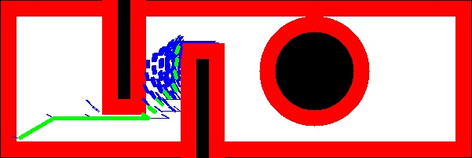
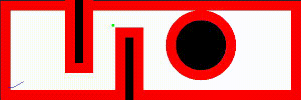

# A-star_Non-Holonomic

Github : https://github.com/sj0897/A-star_Non-Holonomic

## Final Output


## Animation
 

##
Necessary libraries : numpy, openCV

Note : Please ensure ffmpeg is also installed to be able to genearte an accessiable animation file
## Run
```
cd Part_1
python3 main.py
```
Then follow on screen instructions to run the program and generate an animation video (.avi)

Copy the folder in Part2 to your catkin workspace and build the work space
Please ensure necessary turtlebot packages are avaliable and have been tested to move a turtlebot in the gazebo environment and the model has been exported

## Run
```
roslaunch A_star main.launch
```
The above commands uses the default atart and goal poses

To pass your own start and goals, start arguments are in m and radians, goal is specified in cm 

### Run
```
roslaunch A_star main.launch sx:=-0.25 sy:=-0.75 syaw:=0.523 rpm1:=100 rpm2:=50 clearance:=2 gx:=175 gy:=50
```

## Video
https://youtu.be/99-Isw6Rsbk 